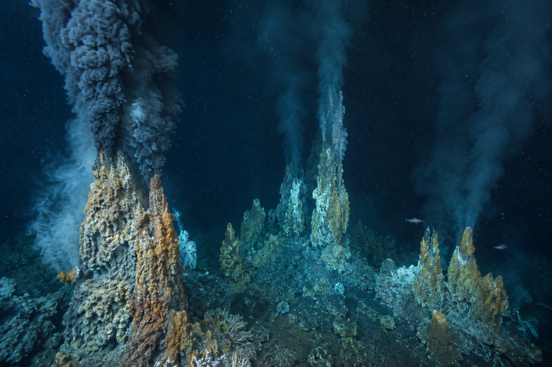

# hydrovent_field

**[Português (Brasil)](README.pt-BR.md) | English**

[](https://github.com/cesarrlamaral/hydrovent_field/actions/workflows/tests.yml)
[](LICENSE)

A procedural mid-ocean-ridge hydrothermal vent field generator and simulation
tool, built to test physically grounded, literature-cited hypotheses about
prebiotic molecule concentration near hydrothermal vents — including plume
dilution/reactive-species chemistry, four classical concentration mechanisms
(pore thermophoresis, mineral adsorption, proton-gradient compartmentalization,
plume dilution), and an original acoustic-concentration hypothesis evaluated
against real measured vent sound pressures.

This is a real simulation tool, not a toy/demo: every physical model is
implemented from a cited primary source, validated against field-measured
benchmarks where data exists, and every unverified or illustrative choice is
flagged explicitly rather than hidden. See
[`docs/PHYSICS_MODEL.md`](docs/PHYSICS_MODEL.md) for the full equation-by-equation
documentation with citations, benchmarks, and an explicit "limitations and
unverified elements" section.



## Features

- **Procedural terrain and vent field**: diamond-square heightmap, axial rift
  valley, clustered vents classified as black smoker / white smoker / diffuse
  flow.
- **Validated plume physics**: Morton–Taylor–Turner (1956) stratified integral
  plume model (`plume_physics.py`, solved via `scipy.integrate.solve_ivp`) and
  cited reaction kinetics for H₂S/Fe(II)/Mn(II) oxidation
  (`reaction_kinetics.py`), benchmarked against real field-measured values
  (Mottl & McConachy 1990, Lupton et al. 1985, Rudnicki & Elderfield 1993,
  Field & Sherrell 2000).
- **Four classical prebiotic concentration modules** (`prebiotic.py`):
  dilution, pore thermophoresis (calibrated against Baaske et al. 2007 for
  nucleotides), mineral adsorption, and proton-gradient compartmentalization
  (calibrated against a real biological reference, Sojo et al. 2016).
- **Original acoustic-concentration hypothesis** (`acoustics.py`): tests
  whether the real, measured acoustic field of hydrothermal vents (Crone et
  al. 2006) can concentrate prebiotic molecules, via two physically distinct
  mechanisms — boundary acoustic streaming (a real steady-state
  advection-diffusion PDE) and Gor'kov radiation-force particle trapping —
  each independently selectable.
- **Sensitivity analysis**: Latin Hypercube sampling over parameters with a
  documented literature uncertainty range (`--sensitivity-sweep`).
- **Ensembles of up to 10,000 runs**, sequential or parallelized across CPU
  cores (`--parallel`), with reproducible per-run seeding, crash detection,
  and resume support.
- **Desktop GUI** (`gui.py`, Tkinter) and a scriptable **CLI**
  (`fumarola_field.py`), both driving the same underlying simulation code.
- An independent **bench-scale acoustic-patterning dataset** (author-collected,
  2021, `data/chladni_bench_2021/`) used to cross-check the acoustic
  hypothesis against real laboratory measurements.

## Installation

Requires **Python 3.10+**.

```bash
git clone https://github.com/cesarrlamaral/hydrovent_field.git
cd hydrovent_field
pip install -r requirements.txt
```

The GUI uses Tkinter, part of the Python standard library. It ships with the
official Windows/macOS installers from python.org; on Linux it is usually a
separate system package:

```bash
# Debian/Ubuntu
sudo apt install python3-tk
```

## Usage

### GUI

```bash
python gui.py
```

Configure the terrain/vent-field/prebiotic-module parameters, choose single
run or ensemble (up to 10,000 runs, optionally parallel across CPU cores),
and view results with a zoom/pan image viewer and a live ensemble-statistics
tab.

### CLI

```bash
# Single run
python fumarola_field.py --seed 42 --size 257 --n-clusters 6 --spreading-rate 60

# Ensemble of 1000 runs, acoustic hypothesis + sensitivity sweep, in parallel
python fumarola_field.py --seed 42 --runs 1000 --acoustic-mode both \
    --sensitivity-sweep --parallel

# Full flag reference
python fumarola_field.py --help
```

Without `--runs`, an interactive menu walks through single-run vs. ensemble
mode, image generation, and (for ensembles) parallel execution.

### Tests

```bash
pytest tests/
```

## Repository layout

```
fumarola_field.py       Terrain/vent-field generation, CLI, ensemble orchestration
plume_physics.py        Morton-Taylor-Turner plume rise/dilution model
reaction_kinetics.py    Cited reactive-species decay kinetics
prebiotic.py            Classical concentration modules + hotspot analysis
acoustics.py            Acoustic-concentration hypothesis (streaming + Gor'kov trap)
ensemble_stats.py       Shared ensemble statistics (used by gui.py) — descriptives, robust
                        stats (IQR/MAD/skewness/kurtosis), optional bootstrap CIs
variance_decomposition.py  Nested-design stochastic vs. parametric variance decomposition
global_sensitivity.py   Sobol' global sensitivity indices via a from-scratch GP surrogate
driver_regression.py    Multivariate rank-transform regression (controls all predictors
                        at once, replacing one-at-a-time correlation)
ensemble_report.py      Open, no-login HTML statistical report for the GUI (tables +
                        ensemble-level charts only — no discussion/interpretation)
convergence_analysis.py Monte Carlo convergence traces + analytic CI-width forecasting
                        (does a larger ensemble need to be run at all?)
numerical_convergence.py  Solver verification: ODE tolerance / PDE grid refinement studies
run_qa.py               Automated per-run integrity QA (hard errors vs. statistical
                        outlier flags, kept deliberately separate)
gui.py / i18n.py        Desktop GUI and its PT/EN string tables
tests/                  pytest suite
docs/PHYSICS_MODEL.md   Full physics documentation: every equation, citation, benchmark
data/chladni_bench_2021/      Bench-scale acoustic-patterning dataset + reanalysis
```

## Citing

If you use this software, please cite the repository (a `CITATION.cff` file
is included for GitHub's "Cite this repository" button).

## License

[MIT](LICENSE) — see the LICENSE file. Copyright (c) 2026 Cesar Amaral.

## Author

Dr. Cesar Amaral — Environmental Molecular Genetics and Astrobiology Group
(NGA), Dept. of Biophysics and Biometry, IBRAG, UERJ.
[www.ngauerj.org](http://www.ngauerj.org)
